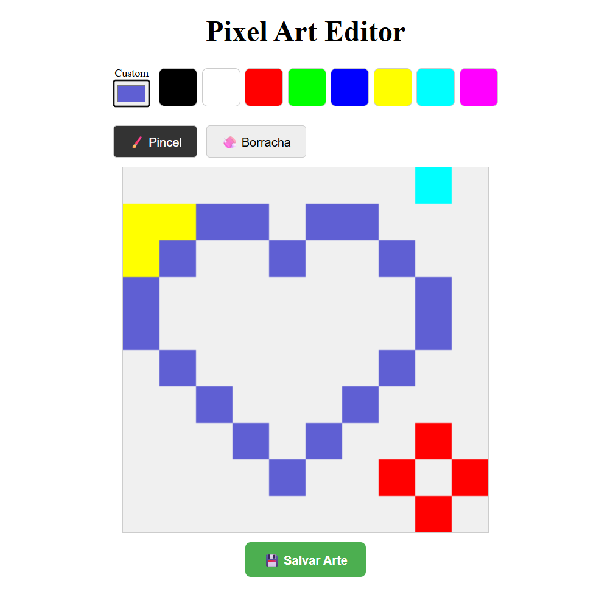

# 🎨 Pixel Art Pro


> **Uma implementação moderna e tipada do clássico "Pixel Art Editor" do livro Eloquent JavaScript.**

Este projeto é o código-fonte final desenvolvido no livro/guia **"Pixel Art Pro: Dominando a Lógica do JavaScript"**. O objetivo é demonstrar como pegar a lógica complexa de manipulação de bits e arrays e aplicá-la em uma arquitetura moderna com **React Hooks** e **TypeScript**.

---

## 📸 Demonstração



---

## ✨ Funcionalidades (Features)

O projeto vai muito além de um simples canvas. Ele implementa um editor gráfico funcional:

- **🖌️ Pincel Dinâmico:** Desenhe pixels livremente em uma grade matemática.
- **🧼 Borracha Inteligente:** Ferramenta dedicada para remover pixels (resetar para a cor de fundo).
- **🎨 Seletor de Cores Híbrido:**
  - **Paleta Rápida:** Acesso instantâneo a cores comuns.
  - **Color Picker Nativo:** Escolha qualquer cor do espectro Hexadecimal.
- **💾 Exportação de Arte:** Converta sua matriz de dados em um arquivo de imagem **PNG** real e baixe para sua máquina.
- **📐 Grade Responsiva:** Lógica baseada em vetores matemáticos, escalável para qualquer tamanho de tela.

---

## 🛠️ Tecnologias Utilizadas

Este projeto foi modernizado para refletir o mercado de trabalho de 2025:

- **[React](https://reactjs.org/)**: Para construção da UI baseada em componentes.
- **[TypeScript](https://www.typescriptlang.org/)**: Para tipagem estrita das estruturas de dados (`Picture`, `PixelUpdate`).
- **[Vite](https://vitejs.dev/)**: Para um ambiente de desenvolvimento ultra-rápido.
- **HTML5 Canvas API**: Para renderização gráfica de alta performance (GPU).
- **CSS Modules / Inline**: Para estilização ágil e focada.

---

## 🚀 Como Rodar Localmente

Siga os passos abaixo para ter o editor rodando na sua máquina:

1.  **Clone o repositório:**

    ```bash
    git clone https://github.com/gothd/pixel-art-pro.git
    ```

2.  **Entre na pasta:**

    ```bash
    cd pixel-art-pro
    ```

3.  **Instale as dependências:**

    ```bash
    npm install
    ```

4.  **Rode o servidor de desenvolvimento:**

    ```bash
    npm run dev
    ```

5.  **Acesse no navegador:**
    Geralmente em `http://localhost:5173`

---

## 📂 Estrutura do Projeto (Didática)

Para ajudar nos seus estudos, o código está organizado da seguinte forma:

```text
src/
├── components/
│   ├── PictureCanvas.tsx  # O "motor" visual (useRef + useEffect)
│   ├── ColorPicker.tsx    # Lógica de seleção de cores
│   └── ...
├── types.ts               # O "DNA" (Interfaces Picture, Pixel, etc)
├── App.tsx                # O "cérebro" (Gerenciamento de Estado Global)
└── main.tsx               # Ponto de entrada
```

---

## 📚 Créditos e Inspiração

A lógica core deste projeto (Array Plano para manipulação de pixels) foi inspirada no Capítulo 19 do livro **[Eloquent JavaScript](https://eloquentjavascript.net/)** de Marijn Haverbeke.

A refatoração para React + TypeScript foi desenvolvida como parte do material educacional de **Ruan Oliveira Sena**.

---

## 📝 Licença

Este projeto está sob a licença **MIT**. Sinta-se livre para usar, modificar e aprender com ele.
